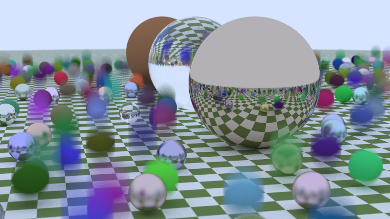
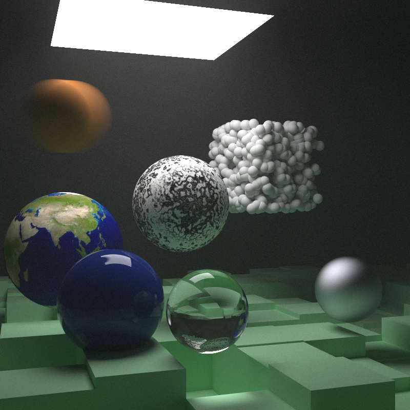

## Installation and Usage

```console
git clone git@github.com:yesencan/raytracing.git
cd raytracing
g++ -std=c++20 -o rt main.cpp
./rt > image.ppm
```

## Choosing Scenes
Modify the switch statement in main.cpp to choose another scene. For example, to render the scene below with spheres on a checkered ground do this:

```cpp
int main() {
    switch (1) {
        ...
    }
```

## Sample Images




## References

This renderer was built by following Peter Shirley's [Ray Tracing in One Weekend](https://raytracing.github.io/books/RayTracingInOneWeekend.html) and [Ray Tracing the Next Week](https://raytracing.github.io/books/RayTracingInOneWeekend.html).